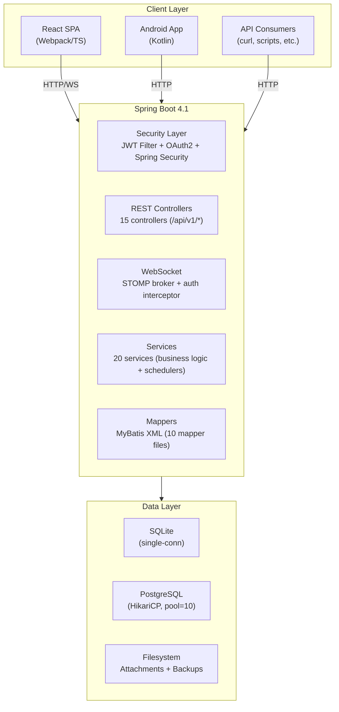
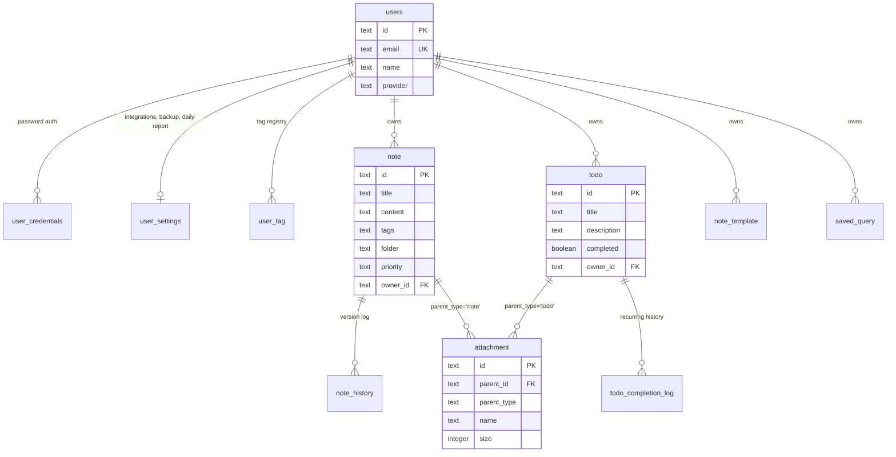
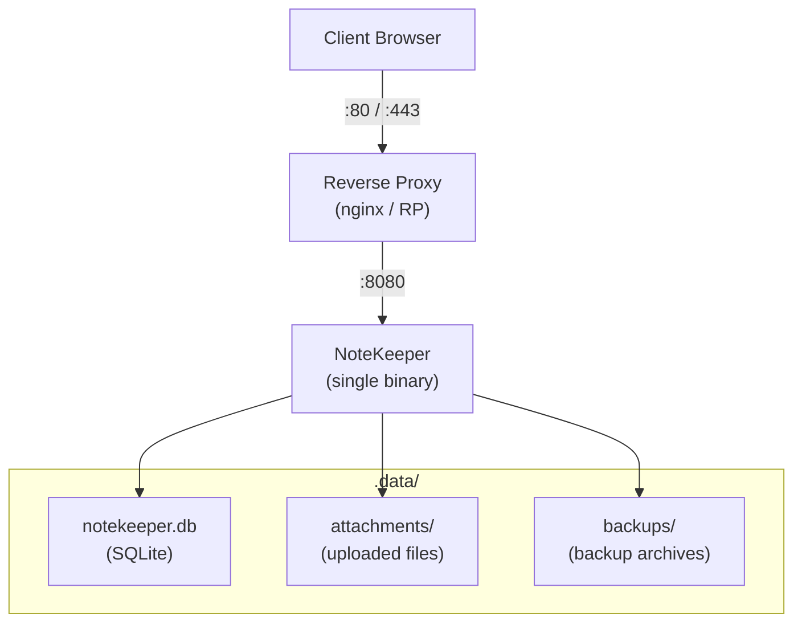

# NoteKeeper — Product Requirements Document (PRD)

**Version:** 1.0  
**Last Updated:** 2026-09-03  
**Status:** Active  
**Author:** NoteKeeper Team

---

## 1. Product Overview

### 1.1 Vision

NoteKeeper is a self-hosted, open-source note-taking and task management application that serves as a privacy-first alternative to cloud-based solutions like Evernote, Notion, and Microsoft To Do. It combines rich Markdown note-taking with powerful todo management, recurring tasks, and multi-channel notifications — all deployable as a single binary with zero external dependencies.

### 1.2 Problem Statement

Existing note-taking and todo applications force users to choose between:
- **Cloud-dependent tools** (Evernote, Notion) — vendor lock-in, data sovereignty concerns, subscription costs
- **Self-hosted tools** — fragmented ecosystems, separate apps for notes vs. tasks, complex deployment
- **Feature-rich tools** — heavy resource usage, slow startup, enterprise licensing

NoteKeeper solves this by providing a unified notes + todos platform that runs as a single binary (GraalVM native image) with SQLite out-of-the-box, requiring no JVM, no Docker, and no external services.

### 1.3 Target Users

| Persona | Description |
|---------|-------------|
| **Privacy-conscious individual** | Wants full data ownership, self-hosted, no cloud dependency |
| **Developer / power user** | Comfortable with CLI, Docker, or native binaries; values Markdown, keyboard shortcuts, API access |
| **Small team / family** | Needs multi-user support with sharing, but not enterprise SaaS complexity |
| **NAS / homelab operator** | Deploys on Synology, K3s, or bare metal; wants minimal resource footprint |

### 1.4 Success Metrics

| Metric | Target |
|--------|--------|
| Cold start (native binary) | < 1 second |
| Memory footprint (idle) | < 100 MB |
| Single-binary deployment | No JVM, no Docker required |
| Lighthouse performance score | > 90 |
| Test coverage | > 70% backend services |

---

## 2. Functional Requirements

### 2.1 Authentication & User Management

#### FR-AUTH-001: Local Registration & Login — ✅ Done
- Users register with email + password
- Passwords hashed with SHA-256 + random salt
- JWT issued on login (HS256, 24h expiry, subject = userId UUID)

#### FR-AUTH-002: Google OAuth2 Login — ✅ Done
- Users authenticate via Google OAuth2 OIDC
- On first login, user account auto-created with Google profile data
- Subsequent logins link to existing account via `googleId`

#### FR-AUTH-003: JWT Token Management — ✅ Done
- All API requests (except `/auth/**`) require `Authorization: Bearer <token>`
- Token contains userId as subject claim
- Configurable expiry via `JWT_EXPIRY_MS` env var (default: 86400000ms = 24h)

#### FR-AUTH-004: User Profile Management — ✅ Done
- Users can view and update their profile (name, email, avatar URL)
- User search endpoint for sharing (by email/name)

### 2.2 Notes Management

#### FR-NOTE-001: CRUD Operations — ✅ Done
- Create notes with title, Markdown content, tags, folder/subfolder, priority
- Read notes with full content, attachments, and version history
- Update any field; changes recorded in history
- Delete: soft-delete (move to trash) by default; `?permanent=true` for hard delete

#### FR-NOTE-002: Folder Organization — ✅ Done
- Two-level hierarchy: folder + optional subfolder
- Virtual "root" path for unfiled notes
- Folder tree derived from existing notes (no separate folder entity)

#### FR-NOTE-003: Tagging — ✅ Done
- Free-form tags (list of strings per note)
- User-scoped tag registry auto-maintained (TagSyncService)
- Filter notes by tag

#### FR-NOTE-004: Priority Levels — ✅ Done
- Three levels: `low`, `medium` (default), `high`
- Visual badges in UI; filterable

#### FR-NOTE-005: Encryption — ✅ Done
- AES-256-GCM server-side encryption of note content
- Key configured in `application.yml` (Base64-encoded 32-byte key)
- Encryption flag per note; encrypted content unreadable without key

#### FR-NOTE-006: Version History — ✅ Done
- Every edit creates a `note_history` entry (action: created/edited/restored)
- Users can view full history and restore any previous version
- Restore creates new history entry

#### FR-NOTE-007: Import — ✅ Done
- Import notes from uploaded text files
- Optional folder/subfolder assignment during import

#### FR-NOTE-008: Templates — ✅ Done
- Create reusable Markdown templates with name, content, tags, category
- Create note from template (pre-fills content and tags)
- List/delete templates; owner-scoped

#### FR-NOTE-009: Reminders (Display Only) — ✅ Done
- Notes can have a reminder datetime
- Display-only — no notification dispatch (unlike todo reminders)

### 2.3 Todo Management

#### FR-TODO-001: CRUD Operations — ✅ Done
- Create todos with title, Markdown description, tags, priority, due date, reminder
- Soft-delete / permanent-delete (same pattern as notes)
- Archive / restore

#### FR-TODO-002: Completion Tracking — ✅ Done
- Toggle completed state
- Completion timestamp recorded
- Filter by completion status

#### FR-TODO-003: Recurring Todos — ✅ Done
- Recurrence patterns: `none`, `daily`, `weekly`, `monthly`, `weekdays`, `custom`
- Custom: user-selected days of week
- Optional end date for recurrence series
- `completed` means done for **current period only** — rollover resets it
- Completion log tracks each occurrence (todo_completion_log table)
- `lastCompletedAt` for display; `/todos/{id}/completions` for full history

#### FR-TODO-004: Reminder Notifications — ✅ Done
- Set reminder datetime per todo
- ReminderService checks every 60 seconds for due reminders
- Notification sent via configured channels (Telegram, DingTalk, or both)
- `notifiedAt` set after send; reminder NOT advanced (prevents double-jump)
- Changing reminder time clears `notifiedAt` so new time can fire

#### FR-TODO-005: Notification Channels — ✅ Done
- Per-todo `notificationChannels` field (comma-separated: "telegram", "dingtalk")
- Null/empty = send to all configured channels
- Empty string = no notifications

#### FR-TODO-006: Location — 🟡 Planned
- Schema supports latitude, longitude, address
- Not yet exposed in UI or notification logic

### 2.4 Search

#### FR-SEARCH-001: Full-text Search — ✅ Done
- Search across notes (title + content) and todos (title + description)
- Returns combined results with type discrimination

#### FR-SEARCH-002: Saved Queries — ✅ Done
- Save search text + filters (type, tags, priority, folder) as named query
- List/delete saved queries
- Owner-scoped

#### FR-SEARCH-003: Filter Parameters — ✅ Done
- Notes: folder, tag, priority, isFavorite, isEncrypted, isArchived, isDeleted
- Todos: completed, tag, priority, isFavorite, isArchived, isDeleted

### 2.5 Attachments

#### FR-ATT-001: File Upload — ✅ Done
- Upload single file or batch upload
- Linked to parent note or todo via `parent_id` + `parent_type`
- Stored on filesystem in configured attachments directory

#### FR-ATT-002: File Management — ✅ Done
- Download by attachment ID
- Delete attachment (removes from DB; file cleanup TBD)
- Attachments listed with note/todo responses

### 2.6 Sharing

#### FR-SHARE-001: Share Notes/Todos — ✅ Done
- Owner shares with another user by userId
- Shared items appear in "Shared with me" view
- Recipients can read but not modify (owner-only write)

#### FR-SHARE-002: Unshare — ✅ Done
- Owner removes sharing access
- Item disappears from recipient's "Shared with me"

### 2.7 Backup & Restore

#### FR-BACKUP-001: Manual Export/Import — ✅ Done
- Export all data as JSON file
- Import from JSON backup file (full replace)

#### FR-BACKUP-002: Scheduled Backups — ✅ Done
- Auto-backup with configurable cron schedule
- Retention period (days) — old backups auto-deleted
- Per-user backup settings

#### FR-BACKUP-003: Backup Management — ✅ Done
- List all backups with filename, size, date
- Download individual backup files
- Delete specific backups

### 2.8 Integrations

#### FR-INT-001: Telegram Notifications — ✅ Done
- Per-user bot token + chat ID configuration
- SendMessage via Telegram Bot API
- MarkdownV2 formatting with plain-text fallback
- Webhook endpoint for bidirectional communication

#### FR-INT-002: DingTalk Notifications — ✅ Done
- Per-user webhook URL + optional HMAC-SHA256 secret
- SendMessage via DingTalk Robot API

#### FR-INT-003: Daily Reports — ✅ Done
- Scheduled summary of uncompleted todos
- Configurable time, channels, body template, item template
- Template variables: `{date}`, `{todo_count}`, `{todo_list}`, `{title}`, `{priority}`, `{priority_icon}`, `{due_date}`, `{tags}`, `{link}`
- Test/preview endpoint for template debugging
- Once-per-day deduplication via `daily_report_last_sent`

#### FR-INT-004: Test Notifications — ✅ Done
- Send test message to verify integration config
- Available for Telegram and DingTalk

### 2.9 Analytics

#### FR-ANALYTICS-001: Dashboard Statistics — ✅ Done
- Time range: week, month, year
- Metrics: notes created, todos created, todos completed, completion rate
- Top tags by usage count
- Priority distribution (low/medium/high counts)
- Daily activity chart (array of counts per day)

### 2.10 Real-time Notifications

#### FR-WS-001: WebSocket Push — ✅ Done
- STOMP over WebSocket (SockJS fallback)
- Authenticated via JWT token in CONNECT frame
- Push notifications for note/todo CRUD events (NOTE_CREATED/UPDATED/DELETED, TODO_CREATED/UPDATED/DELETED)
- Real-time UI updates across connected clients via `/topic/updates/{ownerId}`

### 2.11 User Interface

#### FR-UI-001: Page Structure — ✅ Done
| Page | Route | Description |
|------|-------|-------------|
| Dashboard | `/` | Overview with recent items, quick stats |
| Notes | `/notes` | List/grid with filters, folder tree |
| Note Editor | `/notes/:id` | Markdown editor with preview, attachments, history |
| Todos | `/todos` | List with filters, completion toggle |
| Todo Editor | `/todos/:id` | Full todo form with schedule, reminders, location |
| Search | `/search` | Full-text search with saved queries |
| Calendar | `/calendar` | Monthly calendar view of due dates/reminders |
| Analytics | `/analytics` | Charts and statistics |
| Favorites | `/favorites` | Combined view of favorited notes + todos |
| Templates | `/templates` | Manage note templates |
| Archive | `/archive` | Archived notes + todos |
| Trash | `/trash` | Soft-deleted items with restore/permanent-delete |
| Settings | `/settings` | Integrations, backup, shortcuts, theme, daily report |
| Login | `/login` | Auth form (local + Google) |

#### FR-UI-002: Theming — ✅ Done
- 12 themes with 8 semantic color tokens each
- CSS custom properties on `:root`; Tailwind classes resolve to vars
- Theme persisted in localStorage
- Dark mode support (colorScheme: dark for dark/darcula themes)

#### FR-UI-003: Responsive Layout — ✅ Done
- Desktop: fixed sidebar + main content
- Mobile (< lg breakpoint): drawer sidebar with hamburger toggle
- Touch-friendly targets; no horizontal scroll

#### FR-UI-004: Keyboard Shortcuts — ✅ Done
- Configurable in Settings
- Defaults: Ctrl+N (new note), Ctrl+T (new todo), Ctrl+K (search), Ctrl+B (toggle sidebar), Esc (exit fullscreen)
- Global listener via ShortcutContext

#### FR-UI-005: Markdown Rendering — ✅ Done
- GitHub Flavored Markdown (tables, strikethrough, task lists)
- Mermaid diagram support
- Syntax-highlighted code blocks
- Preview mode in editor

---

## 3. Non-Functional Requirements

### 3.1 Performance

| NFR | Requirement |
|-----|-------------|
| NFR-PERF-001 | Native binary cold start < 1 second |
| NFR-PERF-002 | JVM cold start < 10 seconds |
| NFR-PERF-003 | API response time < 200ms for list endpoints (1000 items) |
| NFR-PERF-004 | Frontend bundle < 500KB gzipped |
| NFR-PERF-005 | Memory usage < 100MB idle (native) |

### 3.2 Scalability

| NFR | Requirement |
|-----|-------------|
| NFR-SCALE-001 | Single-instance deployment (SQLite) supports up to 50 concurrent users |
| NFR-SCALE-002 | PostgreSQL profile supports multi-instance deployment |
| NFR-SCALE-003 | Database handles 100,000+ notes/todos without degradation |

### 3.3 Security

| NFR | Requirement |
|-----|-------------|
| NFR-SEC-001 | All passwords hashed (SHA-256 + salt); never stored in plaintext |
| NFR-SEC-002 | JWT tokens expire after configurable duration (default 24h) |
| NFR-SEC-003 | CORS restricted to configured origins (localhost:3000, 5173, 8080) |
| NFR-SEC-004 | CSRF disabled (stateless API; token-based auth) |
| NFR-SEC-005 | Encrypted notes use AES-256-GCM with server-managed key |
| NFR-SEC-006 | API endpoints enforce ownership — users can only modify their own resources |
| NFR-SEC-007 | Shared resources enforce read-only for non-owners |

### 3.4 Reliability

| NFR | Requirement |
|-----|-------------|
| NFR-REL-001 | SQLite WAL mode for crash recovery |
| NFR-REL-002 | Automatic database schema migration on startup |
| NFR-REL-003 | Scheduled tasks (reminders, backups, daily reports) continue across restarts |
| NFR-REL-004 | Soft-delete prevents accidental data loss |

### 3.5 Deployability

| NFR | Requirement |
|-----|-------------|
| NFR-DEP-001 | Single binary deployment (GraalVM native) — no JVM required |
| NFR-DEP-002 | Docker image available (JVM and native variants) |
| NFR-DEP-003 | Zero external service dependencies (SQLite mode) |
| NFR-DEP-004 | Configuration via environment variables for containerized deployments |
| NFR-DEP-005 | CI/CD pipeline via Gitea Actions (test, build, deploy) |

### 3.6 Compatibility

| NFR | Requirement |
|-----|-------------|
| NFR-COMP-001 | Backend: Java 25+ (JVM mode) or GraalVM CE 25+ (native mode) |
| NFR-COMP-002 | Frontend: Modern browsers (Chrome, Firefox, Safari, Edge — last 2 versions) |
| NFR-COMP-003 | Mobile: Responsive web UI; Android companion app (API 26+) |
| NFR-COMP-004 | Database: SQLite 3.35+ or PostgreSQL 14+ |
| NFR-COMP-005 | OS: Linux (x86-64-v2+), Windows, macOS (JVM mode) |

### 3.7 Maintainability

| NFR | Requirement |
|-----|-------------|
| NFR-MAIN-001 | Clear module separation: controllers → services → mappers |
| NFR-MAIN-002 | MyBatis XML mappers for all DB queries (no annotation-based SQL) |
| NFR-MAIN-003 | Frontend TypeScript strict mode |
| NFR-MAIN-004 | TypeDoc for frontend API documentation |
| NFR-MAIN-005 | Swagger UI for backend API documentation |

---

## 4. System Architecture

### 4.1 High-Level Architecture

### 4.2 Data Model

### 4.3 Deployment Topology

---

## 5. Current Feature Status

| Feature | Backend | Frontend | Status |
|---------|---------|----------|--------|
| Local auth (register/login) | ✅ | ✅ | Complete |
| Google OAuth2 | ✅ | ✅ | Complete |
| Notes CRUD | ✅ | ✅ | Complete |
| Note encryption | ✅ | ✅ | Complete |
| Note history | ✅ | ✅ | Complete |
| Note import | ✅ | ✅ | Complete |
| Note templates | ✅ | ✅ | Complete |
| Note sharing | ✅ | ✅ | Complete |
| Todo CRUD | ✅ | ✅ | Complete |
| Todo recurrence | ✅ | ✅ | Complete |
| Todo reminders | ✅ | ✅ | Complete |
| Todo sharing | ✅ | ✅ | Complete |
| Folder hierarchy | ✅ | ✅ | Complete |
| Tags | ✅ | ✅ | Complete |
| Search + saved queries | ✅ | ✅ | Complete |
| Attachments | ✅ | ✅ | Complete |
| Backup/restore | ✅ | ✅ | Complete |
| Scheduled backups | ✅ | ✅ | Complete |
| Telegram notifications | ✅ | ✅ | Complete |
| DingTalk notifications | ✅ | ✅ | Complete |
| Daily reports | ✅ | ✅ | Complete |
| Analytics | ✅ | ✅ | Complete |
| Calendar view | ✅ | ✅ | Complete |
| WebSocket push | ✅ | ✅ | Complete |
| 12 themes | ✅ | ✅ | Complete |
| Responsive design | ✅ | ✅ | Complete |
| Keyboard shortcuts | ✅ | ✅ | Complete |
| GraalVM native image | ✅ | ✅ | Complete |
| Docker (JVM) | ✅ | — | Complete |
| Docker (native) | ✅ | — | Complete |
| CI/CD (Gitea) | ✅ | — | Complete |
| Android app | — | ✅ | In Progress |
| Todo location notifications | ✅ (schema) | ❌ | Planned |
| Email notifications | ❌ | ❌ | Planned |
| Multi-language i18n | ❌ | ❌ | Planned |
| Note linking / backlinks | ❌ | ❌ | Planned |
| Collaborative editing | ❌ | ❌ | Future |
| Mobile push notifications | ❌ | ❌ | Planned |

---

## 6. Release Plan

### v0.1 — Current (MVP)
All features marked "Complete" in the table above.

### v0.2 — Near-term
- Android app completion and Play Store release
- Todo location-based reminders (geofencing)
- Email notification channel (SMTP)
- Bulk operations (multi-select notes/todos for archive/delete/tag)

### v0.3 — Medium-term
- Note linking and backlinks (bidirectional)
- Full-text search with ranking (SQLite FTS5 / PostgreSQL tsvector)
- Export to PDF / HTML
- Webhook integrations (generic, not just Telegram/DingTalk)
- User avatars upload

### v0.4 — Long-term
- Real-time collaborative editing (CRDT / OT)
- Plugin / extension system
- Mobile push notifications (FCM / APNs)
- i18n / l10n support
- End-to-end encryption (client-side key management)

---

## 7. Risks & Mitigations

| Risk | Impact | Likelihood | Mitigation |
|------|--------|------------|------------|
| SQLite concurrency limits | Multi-user write conflicts | Medium | Document PostgreSQL migration path; provide schema + migration scripts |
| Encryption key loss | All encrypted notes permanently unreadable | High | Prominent warnings in UI; document key backup procedure; consider key export feature |
| GraalVM native compatibility | Runtime errors (reflection, JNI) | Medium | NativeRuntimeHints registration; CI native build test; fallback to JVM |
| Single-point deployment | Server failure = total downtime | Medium | Backup/restore feature; document PostgreSQL for HA setups |
| JWT token theft | Unauthorized access for up to 24h | Low | Short expiry; HTTPS enforcement in production; consider refresh token rotation |
| Frontend bundle size | Slow initial load on mobile | Low | Code splitting (lazy routes); tree shaking; monitor bundle size in CI |

---

## 8. Glossary

| Term | Definition |
|------|------------|
| **Note** | A Markdown document with metadata (tags, folder, priority, encryption) |
| **Todo** | A task item with optional due date, reminder, recurrence, and notification channels |
| **Rollover** | The process of advancing a recurring todo to the next period and resetting `completed` |
| **Template** | A reusable note blueprint with pre-filled content and tags |
| **Soft Delete** | Moving an item to trash (recoverable); vs. permanent delete (irreversible) |
| **Native Image** | AOT-compiled executable via GraalVM — no JVM required at runtime |
| **Daily Report** | Scheduled digest of pending todos sent via Telegram/DingTalk |
| **Completion Log** | Historical record of each occurrence completion for recurring todos |
